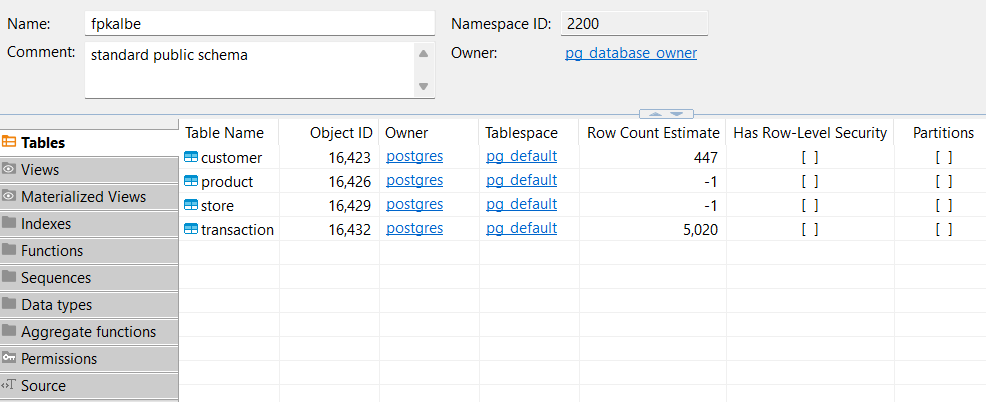
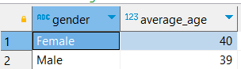
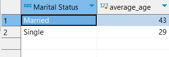
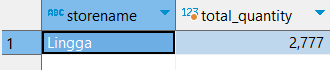
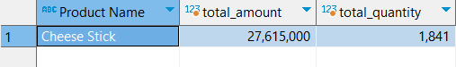

# Project Overview
This project is part of the Rakamin Academy Virtual Internship in collaboration with Kalbe Nutritionals. As a Data Scientist intern, the objective of this project is to perform various data analysis and machine learning tasks. The project involves the following key tasks:

- **Data Ingestion**: Importing and preparing the necessary data for analysis.
- **Exploratory Data Analysis (EDA) Using SQL**: Exploring and understanding the data using SQL queries.
- **Visualizing Data Dashboard Using Tableau**: Creating interactive and insightful data visualizations using Tableau.
- **Predictions Using ARIMA Models**: Building time series forecasting models with ARIMA to predict future trends.
- **Clustering Using KMeans**: Utilizing KMeans algorithm for customer segmentation and analysis.

##  Project Goals 
-  Forecast the estimated quantity of products sold, enabling the inventory team to create sufficient daily stock supply.
-  Create customer segments. These customer segments will be utilized by the marketing team to provide personalized promotions and sales treatment.

# Getting Started
To Collaborate on this project u need to install these requirements

## Tools Used
<a href="https://www.python.org/"></a>
<a href="https://www.postgresql.org/"></a>
<a href="https://dbeaver.io/"></a>
<a href="https://www.tableau.com/"></a>
<a href="https://www.anaconda.com/"></a>
<a href="https://jupyter.org/"></a>
<a href="https://colab.research.google.com/"></a>

## Libraries Used
<a href="https://numpy.org/"></a>
<a href="https://pandas.pydata.org/"></a>
<a href="https://matplotlib.org/"></a>
<a href="https://scikit-learn.org/"></a>
<a href="https://pypi.org/project/pmdarima/"></a>

## Dataset Used
- customer.csv
- product.csv
- store.csv
- transaction.csv

## Install Dependencies
**Pandas**

```bash
  pip install pandas
```

**Numpy**

```bash
   pip install numpy
```

**Matplotlib**

```bash
  pip install matplotlib
```

**pmdarima**

```bash
  pip install pmdarima
```

**Seaborn**

```bash
  pip install seaborn
```

# Project Result
## Data Ingestion and Exploratory Data Analysis using PostgreSQL and DBeaver
First we need to install PostgreSQL and DBeaver in local computer and import dataset and use ; separator and this is the DBSchema
 <br>
> This is the challenge result 
- Average Age Based on Gender <br>
  
- Average Age Based on Marital Status <br>
  
- Store Name with Most Quantity <br>
  
- Product with Highest Selling <br>
  
  
also you can view the complete challenge query in here [Challenge_Query](EDA_SQL/Challenge_Query.sql)

## Visualizing Dashboard using Tableau 
- Make a account in Tableau Public
- Create Web Authoring and import the dataset given
- Make 4 worksheet
  - Total quantity sold Month to Month
  - Total amount revenue daily 
  - Total quantity sold by products
  - Total revenue by store name
- Make dashboard and this is the result

you  can check the interactive dashboard from this link <a href="http://surl.li/jlvmu">Tableau Dashboard</a>.

