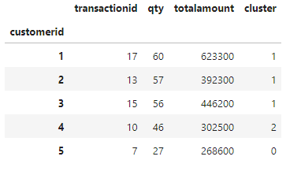

# Project Overview
This project is part of the Rakamin Academy Virtual Internship in collaboration with Kalbe Nutritionals. As a Data Scientist intern, the objective of this project is to perform various data analysis and machine learning tasks. The project involves the following key tasks:

- **Data Ingestion**: Importing and preparing the necessary data for analysis.
- **Exploratory Data Analysis (EDA) Using SQL**: Exploring and understanding the data using SQL queries.
- **Visualizing Data Dashboard Using Tableau**: Creating interactive and insightful data visualizations using Tableau.
- **Predictions Using ARIMA Models**: Building time series forecasting models with ARIMA to predict future trends.
- **Clustering Using KMeans**: Utilizing KMeans algorithm for customer segmentation and analysis.

##  Project Goals 
-  Forecast the estimated quantity of products sold, enabling the inventory team to create sufficient daily stock supply.
-  Create customer segments. These customer segments will be utilized by the marketing team to provide personalized promotions and sales treatment.

# Getting Started
To Collaborate on this project u need to install these requirements

## Tools Used
<a href="https://www.python.org/"></a>
<a href="https://www.postgresql.org/"></a>
<a href="https://dbeaver.io/"></a>
<a href="https://www.tableau.com/"></a>
<a href="https://www.anaconda.com/"></a>
<a href="https://jupyter.org/"></a>
<a href="https://colab.research.google.com/"></a>

## Libraries Used
<a href="https://numpy.org/"></a>
<a href="https://pandas.pydata.org/"></a>
<a href="https://matplotlib.org/"></a>
<a href="https://scikit-learn.org/"></a>
<a href="https://pypi.org/project/pmdarima/"></a>

## Dataset Used
- [Customer](Dataset/customer.csv)
- [Product](Dataset/product.csv)
- [Store](Dataset/store.csv)
- [Transaction](Dataset/transaction.csv)

## Install Dependencies
**Pandas**

```bash
  pip install pandas
```

**Numpy**

```bash
   pip install numpy
```

**Matplotlib**

```bash
  pip install matplotlib
```

**pmdarima**

```bash
  pip install pmdarima
```

**Seaborn**

```bash
  pip install seaborn
```

# Project Result
## Data Ingestion and Exploratory Data Analysis using PostgreSQL and DBeaver
First we need to install PostgreSQL and DBeaver in local computer and import dataset and use ; separator and this is the DBSchema <br>
 <br>
> This is the challenge result 
- Average Age Based on Gender <br>
  
- Average Age Based on Marital Status <br>
  
- Store Name with Most Quantity <br>
  
- Product with Highest Selling <br>
  
  
also you can view the complete challenge query in here [Challenge_Query](EDA_SQL/Challenge_Query.sql)

## Visualizing Dashboard using Tableau 
- Make a account in Tableau Public
- Create Web Authoring and import the dataset given
- Make 4 worksheet
  - Total quantity sold Month to Month
  - Total amount revenue daily 
  - Total quantity sold by products
  - Total revenue by store name
- Make dashboard and this is the result

you  can check the interactive dashboard from this link <a href="http://surl.li/jlvmu">Tableau Dashboard</a>.

## Forecast using ARIMA Models
- First step before we go to forecast is **Data Cleansing**. In this step we merge data into 1 table and clear null values and this is the sample data from merged table <br>
 <br> 
- Next we make new DataFrame for Forecasting value which involves grouping by date and aggregating the 'qty' column using the sum function <br>
 <br>
 <br>
- In order to use the ARIMA model, the data must be in a stationary condition. We check for data stationarity by examining the ACF and PACF plots, as well as conducting the ADF test. The ACF and PACF plot results show a horizontal scatter pattern, indicating that the data is stationary. Additionally, the ADF test result reveals p-values close to zero, further confirming that the data is stationary. <br>
 <br>
 <br>
- The next step involves modeling using ARIMA, where we need to determine the appropriate values for parameters p, d, and q. To achieve this, we explore two approaches: trial-and-error and auto-fit ARIMA. In this project, we used **auto ARIMA** method and found that best parameter is **ARIMA(5,1,0)** <br>
- This is the result for 1 month quantity sold forecast and the mean is 50 quantity product sold <br>
 <br>
- This is the result for 1 month quantity sold forecast for each product <br>
 <br>
you can check the source code here [Forecast Notebook](Predictions/Kalbe_Predictions.ipnyb)

## Clustering using KMeans 
- First step we make new DataFrame for Clstering value which involve grouping by CustomerID and aggregating the 'transaction id' column using the count function, 'qty' column using the sum function  , and 'totalamount' column using the sum function <br>
 <br>
- Next the data is checked for outliers and standardized, as these steps are crucial for the clustering model.
- Next, the elbow method is applied to determine the optimal number of clusters, resulting in three clusters <br>
 <br>
- After that we plot the cluster and visualize it <br>
 <br>
 <br>
Based on the customer segmentation with 3 clusters we can segmentize each clusters for better personalized promotion dan sales treatment.
  - **Cluster 0** is new customers
  - **Cluster 1** is loyal customers
  - **Cluster 2** is potential loyal customers <br>
- For further analysis we use RFM Analysis to make recommendation based on the visualizations <br>
 <br>
So we can conclude that each cluster has its different characteristics and we can make personalized promotion dan sales treatment like this.

- **Cluster 0** is customers that may need incentives to re-engage with our brand.
  - Strategies that can be used
  - Give Extra Discount
  - Give Extra Benefit After Purchasing Product Like Free Shipping
  - Personalized Promotions
- **Cluster 1** is customers that are valuable to our business and should be targeted with exclusive offers to maintain loyalty.
  - Strategies that can be used
  - Give Loyalty Exclusive Offer
  - Give Loyalty Program and Benefits
  - Early Access to Product and Special Discount
- **Cluster 2** is customers that have potential for upselling, as they already purchase occasionally.
  - Strategies that can be used
  - Bundle Offers
  - Offer Loyalty Program with Various Benefits
  - Special Discount

you can check the source code here [Clustering Notebook](Clustering/Kalbe_Clustering.ipnyb)
